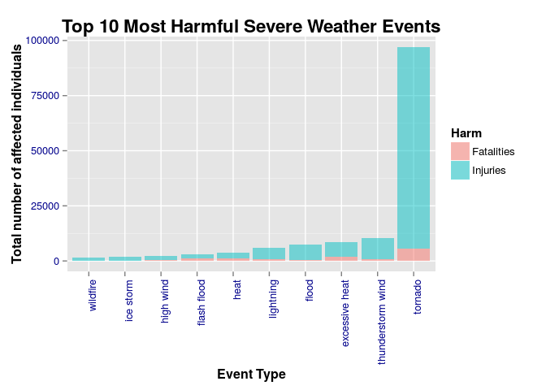
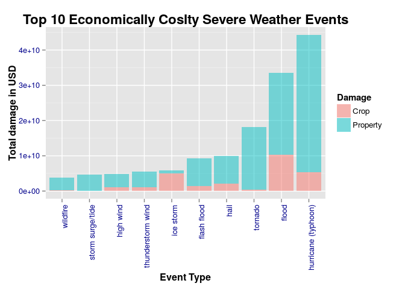

# Weathering the Storm: Identifying severe weather classifiers that are most detrimental to health and economy in the USA
A Evans  
25 October 2015  

## Synopsis
Storms and severe weather events present risks to both population and economy. 
Historic data may provide insights that would allow for contingencies to be put in place to better manage risks and to prioritize resources for dealing with events as they arise.  

The aim of this study was to determine, within the United States, which types of severe weather events are most harmful with respect to population health, and which types of events have the greatest economic consequences.  

To this end, we performed exploratory analysis on data acquired between 1950 and 2011 by the National Weather Service (NWS).  

When all years 1950 to 2011 are considered collectively, tornadoes were found, overall, to be the most harmful weather event with respect to population health, whereas hurricanes (typhoons) carried the greatest economic consequences. Tornadoes posed the greatest risk for both injury and death, hurricanes (typhoons) posed the greatest economic consequences for property, and flooding posed the greatest economic consequences for crops.  

A slightly different picture emerged when NWS database collection methods were taken into account, highlighting the need for caution when drawing inference from this analysis.  


***

## Data Processing 

### Dataset 
A dataset, spanning the period 1950 to 2011, from the The U.S.National Oceanic and Atmospheric Administration's (NOAA) National Weather Service (NWS) maintained [Storm Database][1], was acquired as a a comma delimited bzip2 compressed file [Storm Data][2] [47Mb].

The file consists of 37 columns and 902,298 rows, which includes a single header row. Missing values are coded as blank fields.  

The records acquired span an 61 year period, during which both data collection and processing procedures of the NWS have changed [NWS data collection revisions][3] as follows:

1. 1950 through 1954: Records for tornado events only.
2. 1955 through 1995: Records for tornado, thunderstorm wind and hail events. 
    - 1955 through 1992: extracted from paper publications. 
    - 1993 through 1995: extracted from the unformatted text files.
3. 1996 to present: Records for 48 NWS Directive 10-1605 event types [NWS Storm Documentation][4], [Table 1](#Table 1).  

*Note: Neither the accuracy nor the validity of the dataset is guaranteed by the NWS, and property and crop damage figures serve as broad estimates, only. [NCDC Storm Events FAQ][5].*

***

### Load libraries and define gobal options

Analysis was performed using R base package, and additional packages: knitr; rmarkdown; NLP; tm; ggplot2; reshape.


```r
# load libraries, surpressing warnings
library(knitr)
library(rmarkdown)
library(NLP)
library(tm)
library(ggplot2)
library(reshape)
```

Set global variables.


```r
# Global variables
opts_chunk$set(echo=TRUE, fig.align="center", dev.args=list(bg=rgb(0.95, 0.95, 0.96, 0.8)))
```

Define functions to format output for reporting.


```r
# Function to round and insert commas 
fmt_rounded_big_mark_fun <- function(x){
    format(round(x,0), big.mark=",", scientific=FALSE)
}
```


```r
# Function to round, insert commas and add dollar symbol as prefix
fmt_rounded_big_mark_dollar_fun <- function(x){
    x <- format(round(x,0), big.mark=",", scientific=FALSE)
    paste0("$",x)
}
```


***

### Reading in NWS Directive 10-1605 Event types
NWS Directive 10-1605 event types, introduced in 1996, were acquired from [NWS Storm Documentation][4], [Table 1](#Table 1).


```r
# Extraction of NWS Directive 10-1605 Event types from pd01016005curr.pdf
# Using method of Gregory D. Horne TA:
# https://class.coursera.org/repdata-033/forum/thread?thread_id=46
pdf <- readPDF(control = list(c(text = "-layout")))
pdf <- pdf(elem=list(uri="pd01016005curr.pdf"),language="en")
events <- c(pdf$content[seq(397, 420)], pdf$content[seq(425, 448)])

# clear down 
rm(pdf)
# change event type descriptions from caps to lower case
events <- tolower(events)
```


<!-- comment: HTML anchor point for internal link) --> 
<a name="Table 1"></a>

**Table 1:** National Weather Service Directive 10-1605 Event types.

| Col | Name           | Col | Name           | Col | Name           | Col | Name           |
|-----|----------------|-----|----------------|-----|----------------|-----|----------------|
| 01  | astronomical low tide  | 13  | extreme cold/wind chill | 25  | hurricane (typhoon) | 37  | storm surge/tide |
| 02  | avalanche  | 14  | flash flood | 26  | ice storm | 38  | strong wind |
| 03  | blizzard  | 15  | flood | 27  | lake-effect snow | 39  | thunderstorm wind |
| 04  | coastal flood  | 16  | frost/freeze | 28  | lakeshore flood | 40  | tornado |
| 05  | cold/wind chill  | 17  | funnel cloud | 29  | lightning | 41  | tropical depression |
| 06  | debris flow  | 18  | freezing fog | 30  | marine hail | 42  | tropical storm |
| 07  | dense fog  | 19  | hail | 31  | marine high wind | 43  | tsunami |
| 08  | dense smoke  | 20  | heat | 32  | marine strong wind | 44  | volcanic ash |
| 09  | drought  | 21  | heavy rain | 33  | marine thunderstorm wind | 45  | waterspout |
| 10  | dust devil | 22  | heavy snow | 34  | rip current | 46  | wildfire |
| 11  | dust storm | 23  | high surf | 35  | seiche | 47  | winter storm |
| 12  | excessive heat | 24  | high wind | 36  | sleet | 48  | winter weather |

***

### Reading in NWS Storm Database records for 1950 to 2011  
NWS Storm Database records for 1950 to 2011 were read in from a locally held csv file (repdata_data_StormData.csv), else from a compressed bzip2 file (repdata_data_StormData.csv.bz2), held locally, else download from [Storm Data][1].

Steps were taken to reduce the memory overhead of analysis by:

1) Passing the data file dimensions to R's read.csv function.
2) Selective read in of columns of interest [[Table 2](#Table 2); [Table A1.1](#Table A1.1) in bold].
3) Specifying column class for read in, including a custom date class.  


<!-- comment: HTML anchor point for internal link) --> 
<a name="Table 2"></a>

**Table 2:** NWS Storm Database report columns selected for analysis of the most detrimental weather events.

| Col | Name       | Description                                                             |
|-----|------------|-------------------------------------------------------------------------|
| 02  | BGN_DATE   | Date the storm event began                                              |
| 08  | EVTYPE     | Type of storm event.                                                    |
| 23  | FATALITIES | Number directly killed                                                  |
| 24  | INJURIES   | Number directly injured                                                 |
| 25  | PROPDMG    | Property damage in whole numbers and hundredths                         |
| 26  | PROPDMGEXP | A multiplier where Hundred (H), Thousand (K), Million (M), Billion (B)  |
| 27  | CROPDMG    | Crop damage in whole numbers and hundredths                             |
| 28  | CROPDMGEXP | A multiplier where Hundred (H), Thousand (K), Million (M), Billion (B)  |  


```r
# Set import date format 
# col 3 time zones vary, but only interested in year
setClass("csvDate")
setAs("character","csvDate", function(from) as.Date(from, format="%m/%d/%Y %H:%M:%S") )

# number of rows to read in
nr = 902297

# Read in variables required for analysis
vars <- rep("NULL", 37)
vars[2]  <- "csvDate"   # "BGN_DATE"
vars[8]  <- "character" # "EVTYPE"
vars[23] <- "numeric"   # "FATALITIES" 
vars[24] <- "numeric"   # "INJURIES"
vars[25] <- "numeric"   # "PROPDMG"
vars[26] <- "character" # "PROPDMGEXP"
vars[27] <- "numeric"   # "CROPDMG"
vars[28] <- "character" # "CROPDMGEXP"
cc = vars

if (!file.exists("repdata_data_StormData.csv")) {
    if (!file.exists("repdata_data_StormData.csv.bz2")) { 
        URL <- "https://d396qusza40orc.cloudfront.net/repdata%2Fdata%2FStormData.csv.bz2"
        download.file(URL, destfile = "Project_2/repdata_data_StormData.csv.bz2")
    }
    stormdata <- read.csv("repdata_data_StormData.csv.bz2", sep=",", na.strings = "", 
                         header=TRUE, nrows=nr, colClasses=cc, strip.white=TRUE)
} else { stormdata <- read.csv("repdata_data_StormData.csv", sep=",", na.strings = "", 
                              header=TRUE, nrows=nr, colClasses=cc, strip.white=TRUE) 
}
```


***

### Subset records of interest and standardise formatting 
We cannot arrive at proportional levels of harm by event type from NWS data alone, as, for example, lightning strikes are not recorded unless they have resulted in fatalities, injuries, crop damage or property damage [NCDC Storm Events FAQ][5]. For this reason, analysis was carried out on absolute counts and dollar amounts, which requires retention of records that contain either fatality, injury, property damage or crop damage information. All other rows were excluded.  


```r
# convert to column names to lower case
names(stormdata) <- tolower(names(stormdata))

# drop rows where no losses are reported: returns 254633
stormdata <-stormdata[stormdata$fatalities!=0 | stormdata$injuries!=0 | 
                          stormdata$propdmg!=0 | stormdata$cropdmg!=0,]

# convert event types to lower case
stormdata$evtype <- tolower(stormdata$evtype)

# convert cropdmgexp multiplier code to upper case
stormdata$cropdmgexp <- toupper(stormdata$cropdmgexp)

# convert propdmgexp multiplier code to upper case
stormdata$propdmgexp <- toupper(stormdata$propdmgexp)
```
 

***

### Add year and NWS data collection method classifier
Both reporting and methods of data processing used by the NWS have changed over the years [NWS data collection revisions][3]. 
Between 1950 and 2011, three different methods have been applied: 

1) 1950 through 1954: Reporting for tornado events only
2) 1955 through 1995: Reporting for tornado, thunderstorm wind and hail events.
3) 1996 onward: Reporting for 48 type reporting, defined in the NWS Directive.  

Year was extracted to a new field and a new collection method identifier was added to allow for comparison of most harmful events by collection method.  


```r
# Year
stormdata$year <- strftime(stormdata$bgn_date, "%Y")

# NWS collection method
# 1) 1950 through 1954: Records for tornado events only.
# 2) 1955 through 1995: Records for tornado, thunderstorm wind and hail events.
# 3) 1996 to present: Records for 48 NWS Directive 10-1605 event types NWS 
#    Storm Documentation, Table 1.

nws_collection_method_fun <- function(x){ 
    if (x < 1955) { 
        colmeth <- 1
    } else if (x >= 1955 & x < 1996) {
        colmeth <- 2
    } else if (x >= 1996) {
        colmeth <- 3
    } else {
        colmeth <- 0
    }
    return(colmeth)
}

stormdata$colmeth <- sapply(stormdata$year, nws_collection_method_fun )
```


***

### Apply USD dollar multipliers to estimates of crop and property damage
Property and crop damages are provided as estimates only. Submissions to NWS Storm Database are rounded to three significant digits.  
Prior to 1996 property loss by was estimated to dollar amount bins. From 1996 the following multipliers were applied: where “K” for thousands, “M” for millions, and “B” for billions. Estimated crop loss in millions of dollars (started in 2007).  


A full list of multipliers with references is provided [Table A2.1](#Table A2.1).  


*Note: Entry of 0 does not mean $0.*  
*Also note: Napa REFNUM==605943 is incorrectly recorded with exponent 9, rather than an exponent of 6, equating to billions instead of millions.*


```r
# correction of Nappa valley outlier - recode multiplier
stormdata$propdmgexp[(stormdata$bgn_date==as.Date("2006-01-01") & 
                          (round(stormdata$propdmg,0)==115) & stormdata$propdmgexp=="B")] <- "M"

# Multipliers function in dollar amounts
dmgexp_multiplier_fun <- function(x) {
    # where B = US Billions, 10^9
    classifiers <- c("?","-","+",NA,"0","1","2","3","4","5","6","7","8","9",
                        "H","K","M","B")
    multipliers <- c(NA,NA,NA,NA,NA,10^1,10^2,10^3,10^4,10^5,10^6,10^7,10^8,
                        10^9,10^2,10^3,10^6,10^9)
    m <- multipliers[match(x,classifiers)]
    return(m)
}

# convert multiplier
stormdata$propdmgmult <- dmgexp_multiplier_fun(stormdata$propdmgexp)
stormdata$cropdmgmult <- dmgexp_multiplier_fun(stormdata$cropdmgexp)
```


***

### Map events to NWS Directive 10-1605 Event Types
Mapping of NWS EVTYPEs to NWS Directive 10-1605 Event Types in order to facilitate comparisons across all periods within the dataset.  
There are 48 Event Types in total, but some of these events are excluded as they do not map to EVTYPEs for which fatalities, injuries, crop damage or property damage are recorded.  

Mapping was carried out using available information from [NWS Storm Documentation][4], researching terms using online resources, and best guess when mapping could not otherwise be resolved (there was insufficient computational resource to drill into the "remarks" column of the NWS csv file).  


```r
# "Astronomical Low Tide"
stormdata$event[stormdata$evtype %in% c("astronomical low tide","blow-out tide", 
                "blow-out tides")] <- events[1]

# "Avalanche"
stormdata$event[stormdata$evtype %in% c("avalance", "avalanche", "landslide", 
"landslides", "landslide/urban flood", "landslump", "mudslide", "mud slide", 
"mudslides", "mud slides", "mud slides urban flooding", "rock slide", 
"urban flood landslide", "mud/rock slide", "mudslide/landslide")] <- events[2]

# "Blizzard"
stormdata$event[stormdata$evtype %in% c("blizzard", "blizzard/winter storm", 
"high wind/blizzard", "ground blizzard", "blizzard and extreme wind chil", 
"blizzard and heavy snow", "blizzard/freezing rain", "blizzard/heavy snow", 
"blizzard/high wind", "blizzard summary", "blizzard weather", 
"high wind/ blizzard", "high wind/blizzard/freezing ra", 
"high wind/wind chill/blizzard", "blowing snow", 
"blowing snow & extreme wind ch", "blowing snow- extreme wind chi", 
"blowing snow/extreme wind chil", "snowstorm", 
"high wind and heavy snow")] <- events[3]

# "Coastal Flood"
stormdata$event[stormdata$evtype %in% c("beach erosion", "beach erosin", 
"beach erosion/coastal flood", "beach flood", "coastal erosion", "coastal flood", 
"coastal flooding", "coastalflood", "erosion/cstl flood", 
"coastal flooding/erosion", "coastal flooding/erosion", "coastalstorm", 
"coastal storm", "coastal surge", "high winds/coastal flood", " coastal flood", 
"coastal/tidal flood", "cstl flooding/erosion")] <- events[4]

# "Cold/Wind Chill"
stormdata$event[stormdata$evtype %in% c("cold", "cold air tornado", 
"cold and snow", "cold and wet conditions", "cold temperature", "cold wave", 
"cold weather", "cold/wind chill", "cold/winds", "cool and wet", 
"unseasonable cold", "unseasonably cold", "low temperature","cold and frost", 
"cold temperatures", "cold wind chill temperatures", "cool spell", 
"snow- high wind- wind chill", "wind chill", "wind chill/high wind", 
"high wind/low wind chill", "high winds and wind chill", "high wind/wind chill", 
"low wind chill", "record snow/cold", "record snowfall", "record winter snow", 
"prolong cold", "prolong cold/snow", "unseasonably cool", 
"unseasonably cool & wet")] <- events[5]

# "Debris Flow" - classifier absent from current database data cut
# stormdata$event[stormdata$evtype %in% c("")] <- events[6]

# "Dense Fog"
stormdata$event[stormdata$evtype %in% c("fog", "fog and cold temperatures", 
"dense fog", "patchy dense fog")] <- events[7]

# "Dense Smoke"
stormdata$event[stormdata$evtype %in% c("dense smoke", "smoke")] <- events[8]

# "Drought"
stormdata$event[stormdata$evtype %in% c("drought", "drought/excessive heat", 
"heat wave drought", "abnormally dry", "below normal precipitation", 
"record dry month", "record dryness", "dry", "dry conditions", "dry hot weather", 
"dryness", "dry pattern", "dry spell", "dry weather", "excessive heat/drought", 
"excessively dry", "heat drought", "heat/drought", "very dry", 
"unseasonably dry", "hot and dry", "hot/dry pattern","driest month", 
"snow drought", "warm dry conditions")] <- events[9]

# "Dust Devil"
stormdata$event[stormdata$evtype %in% c("dust devel", "dust devil", 
"dust devil waterspout")] <- events[10] 

# "Dust Storm"
stormdata$event[stormdata$evtype %in% c("blowing dust", "dust storm", 
"duststorm", "dust storm/high winds", "saharan dust", 
"high winds dust storm")] <- events[11] 

# "Excessive Heat"
stormdata$event[stormdata$evtype %in% c("extreme heat", "excessive heat", 
"record/excessive heat", "very warm", "unseasonably hot", "unusually warm", 
"unusual/record warmth", "unusual warmth", "unseasonably warm & wet", 
"unseasonably warm year", "unseasonably warm/wet", "record warm", 
"record warm temps.", "record warmth", "record heat wave", 
"record high temperature", "record high temperatures", "hot pattern", 
"hot spell", "hot weather", "high temperature record", "abnormal warmth", 
"prolong warmth")] <- events[12]

# "Extreme Cold/Wind Chill"
stormdata$event[stormdata$evtype %in% c("extended cold", "extreme cold", 
"extreme cold/wind chill", "extreme windchill", "extreme wind chill", 
"record cold", "record snow", "agricultural freeze", "hard freeze", 
"excessive cold", "extreme/record cold", "extreme wind chill/blowing sno", 
"extreme wind chills", "extreme windchill temperatures", "severe cold", 
"hyperthermia/exposure", "hypothermia", "hypothermia/exposure", "recordcold", 
"record cold and high wind", "record cold/frost", "record cool", "record  cold", 
"unusually cold", "unseasonal low temp", "low temperature record")] <- events[13]

# "Flash Flood"
stormdata$event[stormdata$evtype %in% c("dam break", " flash flood", 
"flash flood", "flash flood from ice jams", "flash flood - heavy rain", 
"flash flooding/thunderstorm wi", "flash flood/landslide", 
"flash flood landslides", "flash flood winds", "flash flood/", 
"flash flood/ flood", "flash flood/ street", "flash flood/flood", 
"flash flooding", "flash flooding/flood", "flash floods", "flash floooding", 
"flood flash", "flood flood/flash", "flood/flash", "flood/flash flood", 
"flood/flash flooding", "flood/flash/flood", "flood/flashflood", 
"local flash flood","rapidly rising water", "flash flood/heavy rain", 
"thunderstorm winds/flash flood", "dam failure")] <- events[14]

# "Flood"
stormdata$event[stormdata$evtype %in% c("flooding", "floods", 
"river and stream flood", "river flood", "river flooding", "major flood", 
"flood & heavy rain", "flood/rain/winds", "rural flood", "small stream flood", 
"snowmelt flooding", "urban and small", "urban and small stream floodin", 
"urban flood", "urban flooding", "urban floods", "urban small", 
"urban/small stream", "urban/small stream flood", "urban/sml stream fld", 
"flood", "flooding/heavy rain", "flood/river flood", "ice floes", "ice jam", 
"ice jam flooding", "ice jam flood (minor", "minor flooding", "breakup flooding", 
"severe turbulence", "flood/rain/wind", "flood/strong wind", "flood watch/", 
"hail flooding", "urban and small stream flood", "urban/small flooding", 
"urban small stream flood", "urban/small streamflood", 
"urban/small stream flooding", "urban/small strm fldg", "urban/sml stream fldg", 
"urban/street flooding", "local flood", "minor flood", "high winds/flooding", 
"highway flooding", "heavy rain/flooding", "heavy rain/urban flood", 
"stream flooding", "street flood", "street flooding", 
"small stream and urban flood", "small stream and urban floodin", 
"small stream flooding", "small stream urban flood", "small stream/urban flood", 
"sml stream fld", "urban and small stream", "urban/small", "small stream", 
"small stream and", "urban/small stream  flood", 
"urban/small stream  flood")] <- events[15] 

# "Frost/Freeze"
stormdata$event[stormdata$evtype %in% c("freeze","damaging freeze", "frost", 
"early frost", "freezing spray", "frost/freeze", "frost\\freeze", "early freeze", 
"first frost")] <- events[16]

# "Funnel Cloud"
stormdata$event[stormdata$evtype %in% c("funnel", "funnel cloud.", 
"funnel clouds", "funnels", "funnel cloud", "cold air funnel", 
"cold air funnels", "funnel cloud/hail")] <- events[17]

# "Freezing Fog"
stormdata$event[stormdata$evtype %in% c("freezing fog", "glaze", "glaze ice", 
"glaze/ice storm", "ice fog")] <- events[18]

# "Hail"
stormdata$event[stormdata$evtype %in% c("hail", "hail damage", "hail/wind", 
"hail/winds", "hail 0.75", "hail 0.88", "hail 075", "hail 088", "hail 1.00", 
"hail 1.75", "hail 1.75)", "hail 100", "hail 125", "hail 150", "hail 175", 
"hail 200", "hail 225", "hail 275", "hail 450", "hail 75", "hail 80", "hail 88", 
"hail(0.75)", "hailstorm", "small hail", "non severe hail", "deep hail", 
"hail aloft", "hail/icy roads", "hail storm" , "hailstorms", 
"ice pellets")] <- events[19]

# "Heat"
stormdata$event[stormdata$evtype %in% c("heat", "record heat", 
"unseasonably warm", "unseasonably warm and dry", "warm weather", "heat wave", 
"heat waves")] <- events[20]

# "Heavy Rain"
stormdata$event[stormdata$evtype %in% c("excessive rainfall", 
"excessive wetness", "heavy precipitation", "heavy rain", "heavy rain and flood", 
"heavy rain/lightning", "heavy rains/flooding", "heavy rain/small stream urban", 
"heavy rain/snow", "heavy rainfall", "heavy rains", "hvy rain", 
"heavy rain/severe weather","torrential rainfall", "rain/wind", 
"record rainfall", "rain", "rain/snow", "rainstorm", "heavy shower", 
"unseasonal rain", "heavy mix", "abnormally wet", "prolonged rain", 
"rain and wind", "rain damage", "rain (heavy)", "record precipitation", 
"excessive precipitation", "excessive rain", "extremely wet", "torrential rain", 
"heavy precipatation", "heavy rain and wind", "heavy rain effects", 
"heavy rain/mudslides/flood", "heavy rain; urban flood winds;", 
"heavy rain/wind", "heavy showers", "unseasonably wet", "wet month", 
"wet weather", "wet year", "record/excessive rainfall", "record low rainfall", 
"locally heavy rain", "early rain")] <- events[21]

# "Heavy Snow"
stormdata$event[stormdata$evtype %in% c("excessive snow", "heavy snow", 
"heavy snow and high winds", "heavy snow and strong winds", 
"heavy snow/blizzard", "heavy snow/blizzard/avalanche", 
"heavy snow/freezing rain", "heavy snow/high winds & flood", "heavy snow/ice", 
"heavy snowpack", "heavy snow shower", "heavy snow squalls", "heavy snow-squalls", 
"heavy snow/squalls", "heavy snow/wind", "heavy snow/winter storm", 
"heavy snow and", "heavy snow andblowing snow", "heavy snow and ice", 
"heavy snow and ice storm", "heavy snow/blowing snow", "heavy snowfreezing rain", 
"heavy snow/high", "heavy snow/high wind", "heavy snow/high winds", 
"heavy snow/high winds/freezing", "heavy snow & ice", "heavy snow/ice storm", 
"heavy snow/sleet", "heavy wet snow", "snow advisory", "drifting snow", 
"near record snow", "record may snow", 
"heavy snow   freezing rain")] <- events[22]

# "High Surf"
stormdata$event[stormdata$evtype %in% c("high surf","   high surf advisory", 
"heavy surf", "heavy surf and wind", "heavy surf coastal flooding", 
"heavy surf/high surf", "tidal flooding", "tidal flood", "rogue wave", 
"rough seas", "rough surf", "hazardous surf", "heavy rain/high surf", 
"astronomical high tide", "high surf advisories", "high surf advisory", 
"highswells", "high wind and high tides", "high  swells")] <- events[23]

# "High Wind" 
stormdata$event[stormdata$evtype %in% c("high wind (g40)", "high wind 48", 
"high wind 63", "high wind 70", "high winds", "high winds 55", "high winds 57", 
"high winds 58", "high winds 63","high winds 66", "high winds 67", 
"high winds 73","high winds 76", "high winds 80", "high winds 82", 
"high winds/cold", "strong winds", "tropical storm", "high wind", 
"high wind damage", "high wind/heavy snow", "high  winds", "high winds/", 
"high winds/heavy rain", "high winds heavy rains", "high winds/snow", 
"storm force winds", "wake low wind", " wind", "wind advisory", "wind gusts" , 
"strong wind gust")] <- events[24]

# "Hurricane (Typhoon)"
stormdata$event[stormdata$evtype %in% c("hurricane", "hurricane edouard", 
"hurricane emily", "hurricane erin", "hurricane felix", "hurricane gordon", 
"hurricane opal", "hurricane opal/high winds", "hurricane/typhoon", "typhoon", 
"remnants of floyd")] <- events[25]

# "Ice Storm"
stormdata$event[stormdata$evtype %in% c("ice storm", "ice storm/flash flood", 
"snow and ice storm", "snow/ice storm", "ice storm and snow", 
"icestorm/blizzard")] <- events[26]

# "Lake-Effect Snow" 
stormdata$event[stormdata$evtype %in% c("lake effect snow", "lake-effect snow", 
"heavy lake snow")] <- events[27]

# "Lakeshore Flood" 
stormdata$event[stormdata$evtype %in% c("lake flood", 
"lakeshore flood")] <- events[28]

# "Lightning"
stormdata$event[stormdata$evtype %in% c("lighting", "lightning  wauseon", 
"lightning damage", "lightning fire", "lightning injury", 
"lightning thunderstorm winds", "lightning thunderstorm windss", "lightning.", 
"ligntning", "lightning", "lightning and heavy rain", 
"lightning and thunderstorm win", "lightning/heavy rain", " lightning", 
"lightning and winds")] <- events[29]

# "Marine Hail"
stormdata$event[stormdata$evtype %in% c("marine hail")] <- events[30]

# "Marine High Wind"
stormdata$event[stormdata$evtype %in% c("marine high wind")] <- events[31]

# "Marine Strong Wind"
stormdata$event[stormdata$evtype %in% c("marine strong wind")] <- events[32]

# "Marine Thunderstorm Wind"
stormdata$event[stormdata$evtype %in% c("marine thunderstorm wind",
"marine tstm wind")] <- events[33]

# "Rip Current"
stormdata$event[stormdata$evtype %in% c("rip current", "rip currents/heavy surf", 
"rip currents", "drowning", "rip currents heavy surf")] <- events[34]

# "Seiche"
stormdata$event[stormdata$evtype %in% c("seiche")] <- events[35]

# "Sleet"
stormdata$event[stormdata$evtype %in% c("sleet", "sleet/ice storm", 
"mixed precip", "mixed precipitation", "light freezing rain", 
"freezing drizzle and freezing", "freezing rain and sleet", 
"freezing rain and snow", "freezing rain sleet and", 
"freezing rain sleet and light", "freezing rain", "freezing drizzle", 
"freezing rain/sleet", "freezing rain/snow", "snow freezing rain", 
"snow/freezing rain", "sleet & freezing rain", "sleet/freezing rain", 
"sleet/rain/snow", "sleet/snow" , "sleet storm", "snow/rain", "snow/rain/sleet", 
"snow sleet", "snow/sleet/rain", "snow and sleet", "wet snow")] <- events[36]

# "Storm Surge/Tide"
stormdata$event[stormdata$evtype %in% c("storm surge", "storm surge/tide", 
"high seas", "high swells", "high tides", "high water", "high waves", 
"high wind and seas", "high wind/seas", "heavy seas", 
"hurricane-generated swells", "heavy swells", "marine accident", "marine mishap", 
"wind and wave")] <- events[37]

# "Strong Wind"
stormdata$event[stormdata$evtype %in% c("wind storm", "strong wind", "wind", 
"winds", "wnd", "non-severe wind damage", "non-tstm wind", "non tstm wind", 
"wind damage", "wind/hail", "gusty wind", "gusty wind/hail", 
"gusty wind/hvy rain", "gusty wind/rain", "gusty winds", "gusty lake wind", 
"gusty thunderstorm wind", "gusty thunderstorm winds", "gradient wind", 
"gradient winds", "heatburst")] <- events[38]

# "Thunderstorm Wind"
stormdata$event[stormdata$evtype %in% c("gustnado", "gustnado and", "microburst", 
"microburst winds", "wet microburst", "wet micoburst", "dry microburst", 
"dry microburst 50", "dry microburst 53", "dry microburst 58", 
"dry microburst 61", "dry microburst 84", "dry microburst winds", "downburst", 
"dry mircoburst winds", "thunderstorm hail", "thunderstorm wind/awning", 
"thunderstorm wind", "thuderstorm winds", "thundeerstorm winds", 
"thunderestorm winds", "thunderstorm", "thunderstorm  winds", 
"thunderstorm damage", "thunderstorm damage to", "thunderstorm w inds", 
"thunderstorm winds 2", "thunderstorm wind (g40)", "thunderstorm winds 13", 
"thunderstorm wind 50", "thunderstorm wind g50", "thunderstorm winds 50", 
"thunderstorm wind g51", "thunderstorm wind g52", "thunderstorm wind 52", 
"thunderstorm winds 52", "thunderstorm winds53", "thunderstorm winds 53", 
"thunderstorm wind g55", "thunderstorm wind 56", "thunderstorm wind 59", 
"thunderstorm wind 59 mph", "thunderstorm wind 59 mph.", 
"thunderstorm wind 60 mph", "thunderstorm winds      le cen", 
"thunderstorm winds 60", "thunderstorm winds g60", "thunderstorm winds 61", 
"thunderstorm winds 62", "thunderstorm winds 63 mph", "thunderstorm wind 65 mph", 
"thunderstorm wind 65mph", "thunderstorm wind 69", "thunderstorm wind 98 mph", 
"thunderstorm wind g60", "thunderstorm wind g61", "thunderstorm wind trees", 
"thunderstorm wind.", "thunderstorm winds", "thunderstorm winds and", 
"thunderstorm winds.", "thunderstorm windss", "thunderstorm wins", 
"thunderstorms", "thunderstorms wind", "thunderstorms winds", "thunderstormw", 
"thunderstormw 50", "thunderstormw winds", "thunderstormwinds", 
"thunderstrom wind", "thunderstrom winds", "thundertorm winds", 
"thundertsorm wind", "thundestorm winds", "thunerstorm winds", "tstm", 
" tstm wind", "tstm wind and lightning", "tstm wind damage", " tstm wind (g45)", 
"tstm wind", "tstm wind (g35)", "tstm wind (g40)", "tstm wind 40", 
"tstm wind (41)", "tstm wind  (g45)","tstm wind (g45)", "tstm wind 45", 
"tstm wind g45", "tstm wind 50", "tstm wind 51", "tstm wind 52", "tstm wind 55", 
"tstm wind g58", "tstm wind 65)", "tstm winds", "tstm wnd", "tstmw", 
"tunderstorm wind", "severe thunderstorm", "thunderstorm wind/hail", 
"tstm wind/hail", "severe thunderstorm winds", "severe thunderstorms", 
"thunderstorm wind/lightning", "thunderstorm winds/ flood", 
"thunderstorm winds/flooding", "thunderstorm winds/funnel clou", 
"thunderstorm windshail", "thunderstorm winds hail", "thunderstorm winds/hail", 
"thunderstorm winds lightning", "thunderstorm wind/ tree", 
"thunderstorm wind/ trees", "thundersnow", "whirlwind", 
"thunderstorm winds funnel clou", "thunderstorm winds g", 
"thunderstorm winds/ hail", "thunderstorm winds heavy rain", 
"thunderstorm winds/heavy rain", "thunderstorm winds small strea", 
"thunderstorm winds urban flood", "tstm heavy rain", "thundersnow shower", 
"metro storm, may 26", "downburst winds")] <- events[39]

# "Tornado"
stormdata$event[stormdata$evtype %in% c("landspout", "tornado f0", "tornado f1", 
"tornado f2", "tornado f3", "tornadoes", "tornadoes", "tornado", 
"tornadoes, tstm wind, hail", "torndao", "tornado debris", "tornados", 
"tornado/waterspout", "rotating wall cloud", "wall cloud", 
"wall cloud/funnel cloud", "large wall cloud")] <- events[40]

# "Tropical Depression"
stormdata$event[stormdata$evtype %in% c("tropical depression")] <- events[41]

# "Tropical Storm"
stormdata$event[stormdata$evtype %in% c("tropical storm alberto", 
"tropical storm dean", "tropical storm gordon", 
"tropical storm jerry")] <- events[42]

# "Tsunami"
stormdata$event[stormdata$evtype %in% c("tsunami")] <- events[43]

# "Volcanic Ash"
stormdata$event[stormdata$evtype %in% c("volcanic ash", "vog", 
"volcanic ashfall", "volcanic ash plume", "volcanic eruption")] <- events[44]

# "Waterspout"
stormdata$event[stormdata$evtype %in% c("water spout", "waterspout", 
"waterspout-", "waterspout/", "waterspouts", "wayterspout", "waterspout tornado", 
"waterspout-tornado", "waterspout/tornado", "waterspout/ tornado", " waterspout", 
"waterspout funnel cloud")] <- events[45]

# "Wildfire" 
stormdata$event[stormdata$evtype %in% c("brush fire", "brush fires", 
"forest fires", "grass fires", "wild/forest fire", "wild/forest fires", 
"wildfire", "wildfires", "wild fires")] <- events[46]

# "Winter Storm"
stormdata$event[stormdata$evtype %in% c("winter storms", "winter storm", 
"winter storm high winds", "winter storms", "winter storm/high wind", 
"winter storm/high winds")] <- events[47]

# "Winter Weather"
stormdata$event[stormdata$evtype %in% c("bitter wind chill", 
"bitter wind chill temperatures", "falling snow/ice", "ice", "black ice",
"ice on road", "ice roads", "icy roads", "ice and snow", "ice/strong winds", 
"late season snow", "late freeze", "late season hail", "late season snowfall", 
"late-season snowfall", "late snow", "light snow", "light snowfall", "snow", 
"snow accumulation", "snow and heavy snow", "snow and ice", "snow/ bitter cold", 
"snow/blowing snow", "snow/cold", "snow/heavy snow", "snow/high winds", 
"snow/ice", "snow/ ice", "snow/sleet", "snow/sleet/freezing rain", "snow squall", 
"snow squalls", "winter weather", "winter weather mix", "winter weather/mix", 
"wintry mix", "moderate snow", "moderate snowfall", "light snow and sleet", 
"light snow/flurries", "light snow/freezing precip", "mountain snows", 
"winter mix", "wintery mix", "seasonal snowfall", "snow showers", 
"snowfall record", "snow and cold", "snow and wind", "snow\\cold", "first snow", 
"early snow", "early snowfall", "accumulated snowfall", "ice/snow", "patchy ice", 
"unusually late snow")] <- events[48]

# Additional category to mop up miscellaneous/ unclassifiable events
stormdata$event[stormdata$evtype %in% c("apache county", "excessive", 
"other","?","high", "record high", "record temperature", "record temperatures", 
"temperature record", "monthly precipitation", "monthly rainfall", 
"monthly snowfall", "monthly temperature", "southeast", "record low", "none", 
"lack of snow", "normal precipitation", "northern lights", "no severe weather", 
"red flag criteria", "red flag fire wx", "mild and dry pattern", 
"mild/dry pattern", "mild pattern")] <- "other"

# summary
stormdata$event[stormdata$evtype %in% c("summary august 10", "summary august 11", 
"summary august 17", "summary august 21", "summary august 2-3", 
"summary august 28", "summary august 4", "summary august 7", "summary august 9", 
"summary jan 17", "summary july 23-24", "summary june 18-19", "summary june 5-6", 
"summary june 6", "summary: nov. 16", "summary: nov. 6-7", "summary: oct. 20-21", 
"summary: october 31", "summary of april 12", "summary of april 13", 
"summary of april 21", "summary of april 27", "summary of april 3rd", 
"summary of august 1", "summary of july 11", "summary of july 2", 
"summary of july 22", "summary of july 26", "summary of july 29", 
"summary of july 3", "summary of june 10", "summary of june 11", 
"summary of june 12", "summary of june 13", "summary of june 15", 
"summary of june 16", "summary of june 18", "summary of june 23", 
"summary of june 24", "summary of june 3", "summary of june 30", 
"summary of june 4", "summary of june 6", "summary of march 14", 
"summary of march 23", "summary of march 24", "summary of march 24-25", 
"summary of march 27", "summary of march 29", "summary of may 10", 
"summary of may 13", "summary of may 14", "summary of may 22", 
"summary of may 22 am", "summary of may 22 pm", "summary of may 26 am", 
"summary of may 26 pm", "summary of may 31 am", "summary of may 31 pm", 
"summary of may 9-10", "summary: sept. 18", "summary sept. 25-26", 
"summary september 20", "summary september 23", "summary september 3", 
"summary september 4")] <- "summary"
```


***

### Aggregation by severe weather event and NWS reporting criteria 

Aggregate fatalities by severe weather event and NWS collection method.  


```r
# Aggregate
eventTotFatal <- aggregate(fatalities ~ event + colmeth, 
                           data=stormdata[stormdata$fatalities > 0,],
                           FUN=sum, na.rm=TRUE, na.action = na.omit)

# sort fatalities-event in descending order
eventTotFatalS <- eventTotFatal[order(-eventTotFatal$fatalities, eventTotFatal$event),]

# subset the top 10 events for fatalities for each NWS collection period
eventTotFatalSmeth1 <- head((eventTotFatalS[eventTotFatalS$colmeth==1,]),10)
eventTotFatalSmeth2 <- head((eventTotFatalS[eventTotFatalS$colmeth==2,]),10)
eventTotFatalSmeth3 <- head((eventTotFatalS[eventTotFatalS$colmeth==3,]),10)

# Format injury counts for report output
eventTotFatalSmeth1$fatalities_fmt <- sapply(eventTotFatalSmeth1$fatalities, 
                                             fmt_rounded_big_mark_fun)
eventTotFatalSmeth2$fatalities_fmt <- sapply(eventTotFatalSmeth2$fatalities, 
                                             fmt_rounded_big_mark_fun)
eventTotFatalSmeth3$fatalities_fmt <- sapply(eventTotFatalSmeth3$fatalities, 
                                             fmt_rounded_big_mark_fun)
```


Aggregate injuries by severe weather event and NWS collection method.  


```r
# Aggregate
eventTotInjuries <- aggregate(injuries ~ event + colmeth, data=stormdata[stormdata$injuries > 0,], 
                              FUN=sum, na.rm=TRUE, na.action = na.omit)

# sort fatalities-event in descending order
eventTotInjuriesS <- eventTotInjuries[order(-eventTotInjuries$injuries, eventTotInjuries$event),]

# Subset the top 10 events for injuries for each NWS collection period
eventTotInjuriesSmeth1 <- head((eventTotInjuriesS[eventTotInjuriesS$colmeth==1,]),10)
eventTotInjuriesSmeth2 <- head((eventTotInjuriesS[eventTotInjuriesS$colmeth==2,]),10)
eventTotInjuriesSmeth3 <- head((eventTotInjuriesS[eventTotInjuriesS$colmeth==3,]),10)

# Format injury counts for report output
eventTotInjuriesSmeth1$injuries_fmt <- sapply(eventTotInjuriesSmeth1$injuries, 
                                              fmt_rounded_big_mark_fun)
eventTotInjuriesSmeth2$injuries_fmt <- sapply(eventTotInjuriesSmeth2$injuries, 
                                              fmt_rounded_big_mark_fun)
eventTotInjuriesSmeth3$injuries_fmt <- sapply(eventTotInjuriesSmeth3$injuries, 
                                              fmt_rounded_big_mark_fun)
```


Aggregate crop damages by severe weather event and NWS collection method.  


```r
# Apply damages multiplier
stormdata$cropdmgusd <- stormdata$cropdmg * stormdata$cropdmgmult

# Aggregate
eventTotCropdmgusd <- aggregate(cropdmgusd ~ event + colmeth, 
                                data=stormdata[stormdata$cropdmgusd > 0,], 
                                FUN=sum, na.rm=TRUE, na.action = na.omit)

# sort fatalities-event in descending order
eventTotCropdmgusdS <- eventTotCropdmgusd[order(-eventTotCropdmgusd$cropdmgusd, 
                                                eventTotCropdmgusd$event),]

# Subset the top 10 events for crop damage for each NWS collection period
eventTotCropdmgusdSmeth1 <- head((eventTotCropdmgusdS[eventTotCropdmgusdS$colmeth==1,]),10)
eventTotCropdmgusdSmeth2 <- head((eventTotCropdmgusdS[eventTotCropdmgusdS$colmeth==2,]),10)
eventTotCropdmgusdSmeth3 <- head((eventTotCropdmgusdS[eventTotCropdmgusdS$colmeth==3,]),10)

# Format crop damage in USD for report output
eventTotCropdmgusdSmeth1$cropdmgusd_fmt <- sapply(eventTotCropdmgusdSmeth1$cropdmgusd, 
                                                  fmt_rounded_big_mark_dollar_fun)
eventTotCropdmgusdSmeth2$cropdmgusd_fmt <- sapply(eventTotCropdmgusdSmeth2$cropdmgusd, 
                                                  fmt_rounded_big_mark_dollar_fun)
eventTotCropdmgusdSmeth3$cropdmgusd_fmt <- sapply(eventTotCropdmgusdSmeth3$cropdmgusd, 
                                                  fmt_rounded_big_mark_dollar_fun)
```


Aggregate property damages by severe weather event and NWS collection method.  


```r
# Apply damages multiplier
stormdata$propdmgusd <- stormdata$propdmg * stormdata$propdmgmult

# Aggregate
eventTotPropdmgusd <- aggregate(propdmgusd ~ event + colmeth, 
                                data=stormdata[stormdata$propdmgusd > 0,], 
                                FUN=sum, na.rm=TRUE, na.action = na.omit)

# sort fatalities-event in descending order
eventTotPropdmgusdS <- eventTotPropdmgusd[order(-eventTotPropdmgusd$propdmgusd, 
                                                eventTotPropdmgusd$event),]

# Subset the top 10 events for property damage for each NWS collection period
eventTotPropdmgusdSmeth1 <- head((eventTotPropdmgusdS[eventTotPropdmgusdS$colmeth==1,]),10)
eventTotPropdmgusdSmeth2 <- head((eventTotPropdmgusdS[eventTotPropdmgusdS$colmeth==2,]),10)
eventTotPropdmgusdSmeth3 <- head((eventTotPropdmgusdS[eventTotPropdmgusdS$colmeth==3,]),10)

# Format property damages in USD for report output
eventTotPropdmgusdSmeth1$propdmgusd_fmt <- sapply(eventTotPropdmgusdSmeth1$propdmgusd, 
                                                  fmt_rounded_big_mark_dollar_fun)
eventTotPropdmgusdSmeth2$propdmgusd_fmt <- sapply(eventTotPropdmgusdSmeth2$propdmgusd, 
                                                  fmt_rounded_big_mark_dollar_fun)
eventTotPropdmgusdSmeth3$propdmgusd_fmt <- sapply(eventTotPropdmgusdSmeth3$propdmgusd, 
                                                  fmt_rounded_big_mark_dollar_fun)
```


***


### Top 10 summary - Aggregation by Event acrross all NWS reporting periods 

Aggregate fatalities and injuries by event, derive total affected individuals and subset the top most harmful event types.  


```r
# Aggregate fatalities and injuries by weather event
eventTothealth <- aggregate(cbind(fatalities, injuries ) ~ event, data=stormdata, 
                            FUN=sum, na.rm=TRUE, na.action = na.omit)

eventTothealth$totindv <- eventTothealth$fatalities + eventTothealth$injuries

eventTothealthss <- head(eventTothealth[order(-eventTothealth$totindv, 
                                              -eventTothealth$fatalities,
                                              -eventTothealth$injuries),],10)

# Format injuries, fatalities and total individuals harmed for report output
eventTothealthss$injuries_fmt <- sapply(eventTothealthss$injuries, 
                                                  fmt_rounded_big_mark_fun)
eventTothealthss$fatalities_fmt <- sapply(eventTothealthss$fatalities, 
                                                  fmt_rounded_big_mark_fun)
eventTothealthss$totindv_fmt <- sapply(eventTothealthss$totindv, 
                                                  fmt_rounded_big_mark_fun)

# reshape the dataframe to three col: event, variable, value
eventTothealthssm <- melt(eventTothealthss[1:3], id="event")
```


Aggregate crop and property damage by event, derive total amount of damages in USD and NWS subset the ten most economically costly event types.  


```r
# Apply damage multipliers for crops and property
stormdata$cropdmgusd <- stormdata$cropdmg * stormdata$cropdmgmult
stormdata$propdmgusd <- stormdata$propdmg * stormdata$propdmgmult

# Aggregate
eventTotdamage <- aggregate(cbind(cropdmgusd, propdmgusd) ~ event, data=stormdata, 
                                FUN=sum, na.rm=TRUE, na.action = na.omit)

eventTotdamage$totusd <- eventTotdamage$cropdmgusd + eventTotdamage$propdmgusd

eventTotdamagess <- head(eventTotdamage[order(-eventTotdamage$totusd, 
                                              -eventTotdamage$cropdmgusd,
                                              -eventTotdamage$propdmgusd),],10)

# Format crop, property and total damage in USD for report output
eventTotdamagess$cropdmgusd_fmt <- sapply(eventTotdamagess$cropdmgusd, 
                                                  fmt_rounded_big_mark_dollar_fun)
eventTotdamagess$propdmgusd_fmt <- sapply(eventTotdamagess$propdmgusd, 
                                                  fmt_rounded_big_mark_dollar_fun)
eventTotdamagess$totusd_fmt <- sapply(eventTotdamagess$totusd, 
                                                  fmt_rounded_big_mark_dollar_fun)

# reshape the dataframe to three col: event, variable, value
eventTodamagessssm <- melt(eventTotdamagess[1:3], id="event")
```


Generate summary plots, of data aggregated by event and harm to human health, for data mapped to NWS directive event types across all collection periods.  


```r
# Most harmful to health
p1 <- ggplot(eventTothealthssm, aes(x=reorder(event, value), y=value, 
            fill=factor(variable, labels = c("Fatalities","Injuries")))) + 
    labs (title = "Top 10 Most Harmful Severe Weather Events", x = "Event Type", 
          y = "Total number of affected individuals") + 
    geom_bar(stat="identity", alpha=.5) + 
    guides (fill = guide_legend (title = "Harm")) + 
    theme (axis.text.x = element_text (colour = "darkblue", angle = 90, hjust = 1),
           axis.text.y = element_text (colour = "darkblue"),
           axis.title = element_text (size = 12, colour = "black"), 
           title = element_text (size = 14, colour = "black", face = "bold"), 
           legend.text = element_text (size = 10, colour = "black"))
```


Generate summary plots, of data aggregated by event and economic harm, for data mapped to NWS directive event types across all collection periods.  


```r
# Most harmful to crops and property
p2 <- ggplot(eventTodamagessssm, aes(x=reorder(event, value), y=value, 
            fill=factor(variable, labels = c("Crop","Property")))) + 
    labs (title = "Top 10 Economically Coslty Severe Weather Events", x = "Event Type", 
          y = "Total damage in USD") + geom_bar(stat="identity", alpha=.5) + 
    guides (fill = guide_legend (title = "Damage")) +
    theme (axis.text.x = element_text (colour = "darkblue", angle = 90, hjust = 1),
           axis.text.y = element_text (colour = "darkblue"),
           axis.title = element_text (size = 12, colour = "black"), 
           title = element_text (size = 14, colour = "black", face = "bold"), 
           legend.text = element_text (size = 10, colour = "black"))
```


***


## Results
As stated above, the NWS database is constructed from records obtained by three distinct phases of collection (1950-1954, 1955-1995, 1996-present) [NWS data collection revisions][3].  

Analysis was carried for each NWS collection period independently, and also for the dataset consolidated for 1950 to 2011.  

To facilitate comparisons, an attempt was made to map historically used reporting terms with the current NWS directive Event types, but it should be borne in mind when reviewing the results of analysis that there was insufficient information available to guarantee the accuracy of data mapping, and misclassification is likely.  

Furthermore, the limited reporting criteria between 1950 and 1996 is likely to introduce bias in the effect of Tornadoes, Thunderstorm wind and hail events, as this was the focus of data acquisition until 1996.  

The requirement to report estimated crop losses was not introduced until 2007, so again, these measures are underrepresented within this analysis.  


***

### Analysis by NWS collection period

For collection period 1 (1950-1954, incl), only tornado events were recorded. Figures for estimated crop losses and property damage were absent.  

The collection period 2 (1955-1995) called for reporting of tornado, thunderstorm and hail events only but some records within the NWS csv file were found to map directly to events types that were not introduced until the 1996 NWS directive.  

The findings of analysis carried out for individual collection periods are presented in tables [Table 2](#Table 2); [Table 3](#Table 3); [Table 4](#Table 4); [Table 5](#Table 5); [Table 6](#Table 6); [Table 7](#Table 7).  


As can be seen from table [Table 2](#Table 2), information between 1950 and 1954 was collected for tornadoes only, so all that can be taken from this is that tornado events posed significant risks in terms of risks to the health of the population and economy to warrant monitoring, though there is an absence of records relating to property and crop losses and [Table 5](#Table 5).  


<!-- comment: HTML anchor point for internal link) --> 
<a name="Table 2"></a>

**Table 2:** Top 10 most harmful event types for population health from 1950 through 1954: Reporting for tornado events only.  


| Rank | Event                             | Total No.Fatalities                       |  Event                               | Total No. Injured                          | 
|------|-----------------------------------|-------------------------------------------|--------------------------------------|--------------------------------------------|
| 1    | tornado  | 889 | tornado  | 8,944 |
| 2    | -                                 | -                                         | -                                    | -                                          |


Between 1955 and 1995, the reporting criteria were expanded, but still quite restricted. Tornadoes and thunderstorm wind, the focus of data collection for that period feature prominently in the top 10 severe weather hazards. Hail, which also formed part of the reporting requirement, features less prominently, though still in the top 10. Though if this were to be combined with ice storm, this would be the third most significant weather event in terms of risk to the health of the population [Table 3](#Table 3).  

Heat is also important in terms of injury, but less so in terms of fatality. This may be due to under-reporting, as reporting of incidents of severe heat were not required in this period, as we see in [Table 4](#Table 4), for the collection period 1995 to 2011, that excessive heat is the most important severe weather event in terms of hazard to human health, resulting in the greatest number of deaths and the third greatest number of injuries, though the numbers of injuries and deaths related to Tornadoes vastly exceed the number of injuries and deaths associated with excessive heat.  


<!-- comment: HTML anchor point for internal link) --> 
<a name="Table 3"></a>

**Table 3:** Top 10 most harmful event types for population health from 1955 through 1995: Reporting for tornado, thunderstorm wind and hail events.  


| Rank | Event                             | Total No. Fatalities                       |  Event                               | Total No. Injured                           |
|------|-----------------------------------|--------------------------------------------|--------------------------------------|---------------------------------------------|
| 1    | tornado  | 3,258  | tornado  | 61,753  |
| 2    | heat  | 917  | thunderstorm wind  | 4,384  | 
| 3    | thunderstorm wind  | 333  | ice storm  | 1,659  |
| 4    | excessive heat  | 219  | heat  | 1,237  |
| 5    | lightning  | 166  | lightning  | 1,091  |
| 6    | flash flood  | 149  | hail  | 648  |
| 7    | flood  | 68  | blizzard  | 433  |        
| 8    | high wind  | 53  | high wind  | 370  |
| 9    | extreme cold/wind chill  | 49  | heavy snow  | 334  |
| 10   | cold/wind chill | 36 | excessive heat | 289 |    


It can also be seen that between 1995 and the present, flooding ranks as the second greatest risk for injury, and the third most important for risk of death. It may be worth considering pooling flash flood statistics with floor in any future analysis of the dataset [Table 4](#Table 4).  

<!-- comment: HTML anchor point for internal link) --> 
<a name="Table 4"></a>

**Table 4:** Top 10 most harmful event types for population health from 1996 onward: Reporting for 48 NWS Directive 10-1605 Event types.  


| Rank | Event                             | Total No. Fatalities                       |  Event                               | Total No. Injured                           |
|------|-----------------------------------|--------------------------------------------|--------------------------------------|---------------------------------------------|
| 1    | excessive heat  | 1,797  | tornado  | 20,667  |
| 2    | tornado  | 1,511  | flood  | 6,838  | 
| 3    | flash flood  | 887  | excessive heat  | 6,391  |
| 4    | lightning  | 651  | thunderstorm wind  | 5,154  |
| 5    | rip current  | 543  | lightning  | 4,141  |
| 6    | flood  | 444  | flash flood  | 1,674  |
| 7    | thunderstorm wind  | 383  | wildfire  | 1,458  |        
| 8    | high wind  | 299  | high wind  | 1,442  |
| 9    | avalanche  | 266  | hurricane (typhoon)  | 1,328  |
| 10   | extreme cold/wind chill | 266 | heat | 1,311 |    


The NWS dataset contained fewer years of records for property and crop losses, as described above. Records for 1950 through 1954 did not contain information about dollar losses [Table 5](#Table 5).  

<!-- comment: HTML anchor point for internal link) --> 
<a name="Table 5"></a>

**Table 5:** Top 10 most economically costly event types from 1950 through 1954: Reporting for tornado events only.  


| Rank | Event                                   | Total Crop Damages USD                         |  Event                                | Total Property Damages UDF                     | 
|------|-----------------------------------------|------------------------------------------------|---------------------------------------|------------------------------------------------|
| 1    | -                                       | -                                              | -                                     | -                                              |
| 2    | -                                       | -                                              | -                                     | -                                              |


Between 1955 and 1995, we see once again that both Tornadoes and Flooding feature prominently in top hazard table, but winter weather, storms, ice and frost have a sizable negative impact on the economy [Table 6](#Table 6).  


<!-- comment: HTML anchor point for internal link) --> 
<a name="Table 6"></a>

**Table 6:** Top 10 most economically costly event types from 1955 through 1995: Reporting for tornado, thunderstorm wind and hail events.  


| Rank | Event                                  | Total Crop Damages USD                          |  Event                                 | Total Property Damages UDF                      | 
|------|----------------------------------------|-------------------------------------------------|----------------------------------------|-------------------------------------------------|
| 1    | flood  | $5,842,779,550  | tornado  | $33,059,206,570  |
| 2    | ice storm  | $5,006,453,500  | flood  | $6,087,908,150  |
| 3    | frost/freeze  | $628,100,000  | winter storm  | $5,216,254,000  |
| 4    | drought  | $605,055,780  | hurricane (typhoon)  | $3,637,446,000  |
| 5    | hail  | $550,065,150  | thunderstorm wind  | $3,271,189,200  |
| 6    | heat  | $406,835,000  | heavy rain  | $2,639,489,750  |
| 7    | thunderstorm wind  | $254,722,850  | flash flood  | $2,367,542,700  |
| 8    | heavy rain  | $208,586,000  | hail  | $1,382,326,300  |
| 9    | flash flood  | $197,295,450  | high wind  | $811,172,550  |
| 10   | hurricane (typhoon) | $166,010,000 | wildfire | $736,179,000 |


In the period 1996 to the present we see a dramatic leap in the impact of hurricanes in terms of crop and property damage. Some of this rise will necessarily be the result of inflation compare to the period 1955 to 1995, some of the rise may be due to changes to reporting procedures, but also, this increase may be due to Hurricane Katrina August 23, 2005 – August 31, 2005, which has been billed as being the most costly and amongst the most deadly hurricanes in US history. Here, it would be worth looking the time frame for reporting deaths and losses from Katrina, as it may well be that some of these records have been submitted with 1996 returns [Table 7](#Table 7).  

<!-- comment: HTML anchor point for internal link) --> 
<a name="Table 7"></a>

**Table 7:** Top 10 most economically costly event types from 1996 onward: Reporting for 48 NWS Directive 10-1605 Event types.  


| Rank | Event                                  | Total Crop Damages USD                          |  Event                                 | Total Property Damages UDF                      | 
|------|----------------------------------------|-------------------------------------------------|----------------------------------------|-------------------------------------------------|
| 1    | drought  | $13,367,566,000  | hurricane (typhoon)  | $81,718,889,010  |
| 2    | hurricane (typhoon)  | $5,350,107,800  | storm surge/tide  | $47,835,794,000  |
| 3    | flood  | $5,013,161,500  | flood  | $29,244,581,200  |
| 4    | hail  | $2,496,822,450  | tornado  | $24,616,952,710  |
| 5    | extreme cold/wind chill  | $1,367,743,000  | flash flood  | $15,223,270,910  |
| 6    | flash flood  | $1,334,901,700  | hail  | $14,595,213,420  |
| 7    | frost/freeze  | $1,327,041,000  | high wind  | $12,893,088,700  |
| 8    | high wind  | $1,311,272,300  | thunderstorm wind  | $7,915,357,480  |
| 9    | thunderstorm wind  | $1,016,957,600  | wildfire  | $7,760,449,500  |
| 10   | heavy rain | $738,419,800 | ice storm | $3,642,248,810 |


***

### Summary analysis accross all NWS collection periods

A summary analysis across all NWS collection periods was carried out in an attempt to get the big picture in terms of the most harmful weather events in terms of population health and wealth.  

The following serves as an estimate only, due to the caveats described above, and the likelihood of bias due to changes in reporting criteria.  

From [Table 8](#Table 8) and [Figure 1](#Table 1), we get a clear picture that tornadoes present the single greatest risk to human health, with the number of injuries vastly exceeding the number of deaths.  

As was seen previously, thunderstorm wind, excessive heat and flood are also particularly hazardous, with lightning strike coming in a close 5th major hazard for injury or death.  

<!-- comment: HTML anchor point for internal link) --> 
<a name="Table 8"></a>

**Table 8:** Summary - Top 10 harmful event types from 1950 - 2015: All NWS collection periods combined.  


| Rank | Event                          | Total No. Fatalities                    |  Total No. Injured                    | Total No. Affected Individuals       |
|------|--------------------------------|-----------------------------------------|---------------------------------------|--------------------------------------|
| 1    | tornado  | 5,658  | 91,364  | 97,022  |
| 2    | thunderstorm wind  | 716  | 9,538  | 10,254  |
| 3    | excessive heat  | 2,016  | 6,680  | 8,696  |
| 4    | flood  | 512  | 6,873  | 7,385  |
| 5    | lightning  | 817  | 5,232  | 6,049  |
| 6    | heat  | 1,156  | 2,548  | 3,704  |
| 7    | flash flood  | 1,036  | 1,800  | 2,836  |
| 8    | high wind  | 352  | 1,812  | 2,164  |
| 9    | ice storm  | 89  | 1,977  | 2,066  |
| 10   | wildfire | 90 | 1,608 | 1,698 |


<!-- comment: Add hyper link) --> 
<a name="Figure 1"></a>


```r
# print summary plot: health harm
print(p1)
```



<center> **Figure 1:** Bar plot showing the distribution of fatalities and injuries relative to severe weather event.  </center>  


From [Table 9](#Table 9) and [Figure 2](#Table 2) we see that hurricane (typhoon), flood, tornado, hail and flash flood present the greatest risks for property and crop damage. For crops, we should also note that ice storms present a substantial hazard.  

Comparing the prominence of hurricane as a risk for property and crop damage, whilst noting the absence of hurricane as a major hazard in the death and injury table [Table 1](#Table 1), again raises questions as to the absence or errors in the collation of data from Hurricane Katrina. It also indicates the bias in the assessment of risk that can be introduced with one off cataclysmic weather events.  

<!-- comment: Add hyper link) --> 
<a name="Figure 2"></a>


```r
# print summary plot: economic harm
print(p2)
```


<center> **Figure 2:** Bar plot showing the distribution of dollar amount losses due to crop and property damage relative to severe weather event.  </center>  


<!-- comment: HTML anchor point for internal link) --> 
<a name="Table 9"></a>

**Table 9:** Summary - Top 10 most economically costly event types from 1950 - 2015: All NWS collection periods combined.  


| Rank | Event                          | Total Crop Damage USD                   |  Total Property Damage USD              | Total Economic Cost USD             | 
|------|--------------------------------|-----------------------------------------|-----------------------------------------|-------------------------------------|
| 1    | hurricane (typhoon)  | $5,333,117,800  | $38,996,883,000  | $44,330,000,800  |
| 2    | flood  | $10,245,568,050  | $23,214,572,650  | $33,460,140,700  |
| 3    | tornado  | $355,883,660  | $17,766,781,890  | $18,122,665,550  |
| 4    | hail  | $2,054,367,950  | $7,995,329,190  | $10,049,697,140  |
| 5    | flash flood  | $1,493,689,100  | $7,730,678,080  | $9,224,367,180  |
| 6    | ice storm  | $5,022,110,000  | $903,037,300  | $5,925,147,300  |
| 7    | thunderstorm wind  | $1,168,695,800  | $4,344,378,150  | $5,513,073,950  |
| 8    | high wind  | $1,110,345,850  | $3,692,138,690  | $4,802,484,540  |
| 9    | storm surge/tide  | $855,000  | $4,643,558,000  | $4,644,413,000  |
| 10   | wildfire | $285,822,100 | $3,552,727,470 | $3,838,549,570 |


***

## Discussion
The most commonly listed events involve thunderstorms/winds, hail, tornadoes and flooding.  

Events such as lightning strikes are only included in the storm database in the event of fatality, injury and/or property and crop damage [NCDC Storm Events FAQ][5], so, for this analysis, there was no means of determining the ratio of harmful to non-harmful events, hence the decision to work with absolute counts of death, injury and damage.  

The total costs of property and crop damage are estimates, only, for example, a hail storm in 2006, which gave rise to extensive property damage is listed with a damage amount of $0 ([IRE readme_08][10]).  

Likewise, records may be incomplete else pending finalization. For example, in 2006, whilst Hurricane Katrina (2005), has an estimated death toll of 1,836, and an estimated property damage of $81 billion (possibly in excess of $150 billion dollars) ([Katrina facts][12]), numbers of fatalities and injuries recorded within the Storm database were largely absent. The reason for this is that the NWS does not commit these numbers the database until final numbers are available ([IRE readme_08][10]).  

In addition, data for the period 1950 to 1996 are incomplete and contain inaccuracies, which is attributable to changes in the methods of recording and processing weather report data ([IRE readme_08][10]).  


***


## Summary

1) Across the United States, which types of events (as indicated in the EVTYPE variable) are most harmful with respect to population health?  

    -   In terms of fatality, the most harmful severe weather events for population health are:
        -  tornado 
        -  excessive heat  
        -  heat  
    -   In terms of injuries, the most harmful severe weather events for pupulation health are: 
        -   tornado
        -   flood
        -   thunderstorm wind  

2) Across the United States, which types of events have the greatest economic consequences?  

    -   In terms of damage to crops, the severe weather events with the greatest economic consequences are:
        -   flood
        -   hurricane (typhoon)
        -   ice storm
        -   drought  
    -   In terms of damage to property, the severe weather events with the greatest economic consequences are:
        -   hurricane (typhoon)
        -   storm surge/tide
        -   tornado
        -   flood  


***

## Appendix 1

<!-- comment: HTML anchor point for internal link) --> 
<a name="Table A1.1"></a>

**Table A1.1.** Columns within the storm dataset, with columns selected for analysis highlighted in bold.

| Col   | Name       | Col| Name         | Col   | Name         | Col| Name           |
|-------|------------|----|--------------|-------|--------------|----|----------------|
| 01    | STATE__    | 11 | BGN_LOCATI   | 21    | F            | 31 | ZONENAMES      |
| **02**| BGN_DATE   | 12 | END_DATE     | 22    | MAG          | 32 | LATITUDE       |
| 03    | BGN_TIME   | 13 | END_TIME     | **23**| FATALITIES   | 33 | LONGITUDE      |
| 04    | TIME_ZONE  | 14 | COUNTY_END   | **24**| INJURIES     | 34 | LATITUDE_E     |
| 05    | COUNTY     | 15 | COUNTYENDN   | **25**| PROPDMG      | 35 | LONGITUDE_     |
| 06    | COUNTYNAME | 16 | END_RANGE    | **26**| PROPDMGEXP   | 36 | REMARKS        |
| 07    | STATE      | 17 | END_AZI      | **27**| CROPDMG      | 37 | REFNUM         |
| **08**| EVTYPE     | 18 | END_LOCATI   | **28**| CROPDMGEXP   | 38 | -              |
| 09    | BGN_RANGE  | 19 | LENGTH       | 29    | WFO          | 39 | -              |
| 10    | BGN_AZI    | 20 | WIDTH        | 30    | STATEOFFIC   | 40 | -              |


Field formats and descriptions were sourced from documents available through the Investigative Reporters and Editors Organisation ([IRE storm-events][9]; [IRE readme_08][10]; [IRE layout08][11])

***

## Appendix 2

<!-- comment: HTML anchor point for internal link) --> 
<a name="Table A2.1"></a>

**Table A2.1.** USD Amount multipliers for estimated amount of damage to crops and property incurred by the weather event.

| Code  | $ Multiplier              | < 1996 Crop. dmg. | < 1996 Prop. dmg. | >= 1996 Crop. dmg. | >= 1996 Prop. dmg. |
|-------|---------------------------|-------------------|-------------------|--------------------|--------------------|
| ?     | unknown                   |   Y               |   -               |   -                |  -                 |
| -     | unknown                   |   -               |   Y               |   -                |  -                 |
| +     | unknown                   |   -               |   Y               |   -                |  -                 |
| NA    | unknown                   |   Y               |   Y               |   Y                |  Y                 |
| 0     | unknown                   |   Y               |   Y               |   Y                |  Y                 |
| 1     | < $50                     |   -               |   -               |   -                |  -                 |
| 2     | $50-$500                  |   -               |   Y               |   -                |  -                 |
| 3     | $500-$5,000               |   -               |   Y               |   -                |  -                 |
| 4     | $5,000-$50,000            |   -               |   Y               |   -                |  -                 |
| 5     | $50,000-$500,000          |   -               |   Y               |   -                |  -                 |
| 6     | $500,000-$5,000,000       |   -               |   Y               |   -                |  -                 |
| 7     | $5,000,000-$50,000,000    |   -               |   Y               |   -                |  -                 |
| 8     | $50,000,000-$500,000,000  |   -               |   -               |   -                |  -                 |
| 9     | $5000,000,000 +           |   -               |   -               |   -                |  -                 |
| K     | Thousands                 |   Y               |   Y               |   Y                |  Y                 |
| M     | Millions                  |   Y               |   Y               |   Y                |  Y                 |
| B     | Billions (US)             |   Y               |   Y               |   Y                |  Y                 |


**Examples**  
10.00K = $10,000; 10.00M = $10,000,000; 1.55B = $1,550,000,000

Source: [Database Format Specification] [6]; [NWS Storm Documentation][4] page 12 (and Appendix B); [Transmittal Memorandum for Operations][7]; [Storm Data Export frmt][8].

***

## Appendix 3 - Outlier
A correction was applied to the property damage multiplier for NAPA California, where property damage was reported with a multiplier of billions rather than millions, which was detected through a review of the remarks column for the record (below), as discussed on the Coursera Reproducible Research discussion forum by anonymous https://class.coursera.org/repdata-033/forum/thread?thread_id=67  


grep 605943 repdata_data_StormData.csv

6.00,1/1/2006 0:00:00,"12:00:00 AM","PST",55.00,"NAPA","CA","FLOOD",0.00,,"COUNTYWIDE",1/1/2006 0:00:00,"07:00:00 AM",0.00,,0.00,,"COUNTYWIDE",0.00,0.00,,0.00,0.00,0.00,115.00,"B",32.50,"M","MTR","CALIFORNIA, Western",,3828.00,12218.00,3828.00,12218.00,"Major flooding continued into the early hours of January 1st, before the Napa River finally fell below flood stage and the water receeded. Flooding was severe in Downtown Napa from the Napa Creek and the City and Parks Department was hit with $6 million in damage alone. The City of Napa had 600 homes with moderate damage, 150 damaged businesses with costs of at least $70 million.",605943.00

***

## References and web resources  
[Coursera Forum PDF extraction](https://class.coursera.org/repdata-033/forum/thread?thread_id=46)  
[Coursera Forum Multiplier Outlier](https://class.coursera.org/repdata-033/forum/thread?thread_id=67)  
[Database Format Specification](http://www.spc.noaa.gov/wcm/data/SPC_severe_database_description.pdf)  
[IRE layout08](http://ire.org/media/uploads/files/datalibrary/samplefiles/Storm%20Events/layout08.doc)   
[IRE readme_08](http://ire.org/media/uploads/files/datalibrary/samplefiles/Storm%20Events/readme_08.doc)  
[IRE storms](http://ire.org/media/uploads/files/datalibrary/samplefiles/Storm%20Events/storms.pdf)  
[IRE storm-events](http://ire.org/nicar/database-library/databases/storm-events/)  
[IRE storms.xls](http://ire.org/media/uploads/files/datalibrary/samplefiles/Storm%20Events/storms.xls)  
[Katrina facts](https://www.dosomething.org/facts/11-facts-about-hurricane-katrina)  
[National Climatic Data Center - NOAA](www.ncdc.noaa.gov/)  
[NCDC Storm Events FAQ](https://d396qusza40orc.cloudfront.net/repdata%2Fpeer2_doc%2FNCDC%20Storm%20Events-FAQ%20Page.pdf)  
[NOAA National Climatic Data Center - Storm Events Database Bulk Data Download](https://www.ncdc.noaa.gov/stormevents/ftp.jsp)  
[NWS data collection revisions](https://www.ncdc.noaa.gov/stormevents/details.jsp)  
[NWS Storm Events Database](http://www.ncdc.noaa.gov/stormevents/)  
[NWS Storm Database Structure, Appendix B1](http://www.nws.noaa.gov/wsom/manual/archives/NF429405.HTML#2.2)  
[NWS Storm Documentation](https://www.ncdc.noaa.gov/stormevents/pd01016005curr.pdf)  
[NWS Storm Documentation - other](https://d396qusza40orc.cloudfront.net/repdata%2Fpeer2_doc%2Fpd01016005curr.pdf)  
[RPubs submission link](http://rpubs.com/ofcoursera/120686)  
[Storm Database](http://www.spc.noaa.gov/climo/online/)   
[Storm Data](https://d396qusza40orc.cloudfront.net/repdata%2Fdata%2FStormData.csv.bz2)   
[Storm Data Export frmt](ftp://ftp.ncdc.noaa.gov/pub/data/swdi/stormevents/csvfiles/Storm-Data-Export-Format.docx)  
[Transmittal Memorandum for Operations](http://www.nws.noaa.gov/wsom/manual/archives/NF429405.HTML#2.2.6%20%20Character)  


<!-- comment: Links -->  

[//]: Links  
[1]: http://www.spc.noaa.gov/climo/online/ "Storm Database"
[2]: https://d396qusza40orc.cloudfront.net/repdata%2Fdata%2FStormData.csv.bz2 "Storm Data"  
[3]: https://www.ncdc.noaa.gov/stormevents/details.jsp "NWS data collection revisions"
[4]: https://www.ncdc.noaa.gov/stormevents/pd01016005curr.pdf "NWS Storm Documentation"
[5]: https://d396qusza40orc.cloudfront.net/repdata%2Fpeer2_doc%2FNCDC%20Storm%20Events-FAQ%20Page.pdf "NCDC Storm Events FAQ"
[6]: http://www.spc.noaa.gov/wcm/data/SPC_severe_database_description.pdf "Database Format Specification"
[7]: http://www.nws.noaa.gov/wsom/manual/archives/NF429405.HTML#2.2.6%20%20Character "Transmittal Memorandum for Operations"
[8]: ftp://ftp.ncdc.noaa.gov/pub/data/swdi/stormevents/csvfiles/Storm-Data-Export-Format.docx "Storm Data Export frmt"
[9]: http://ire.org/nicar/database-library/databases/storm-events/ "IRE storm-events"
[10]: http://ire.org/media/uploads/files/datalibrary/samplefiles/Storm%20Events/readme_08.doc "IRE readme_08"
[11]: http://ire.org/media/uploads/files/datalibrary/samplefiles/Storm%20Events/layout08.doc "IRE layout08"
[12]: https://www.dosomething.org/facts/11-facts-about-hurricane-katrina "Katrina facts"
[13]: http://ire.org/media/uploads/files/datalibrary/samplefiles/Storm%20Events/storms.pdf "IRE storms"
[14]: http://ire.org/media/uploads/files/datalibrary/samplefiles/Storm%20Events/storms.xls "IRE storms.xls"
